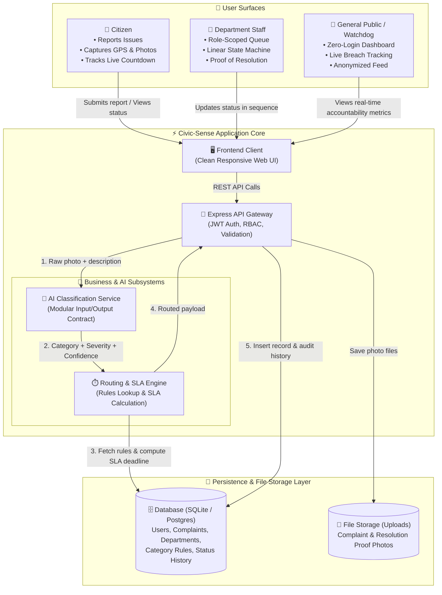
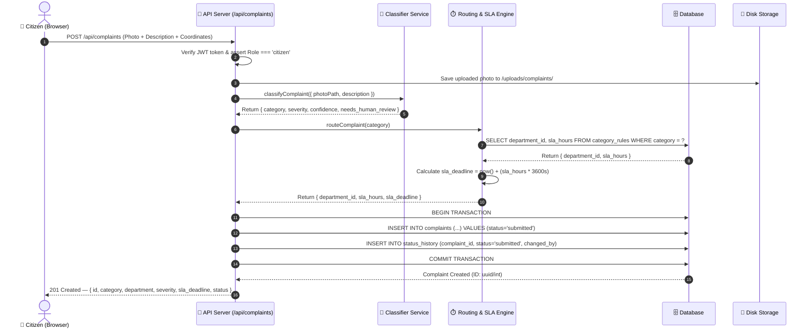
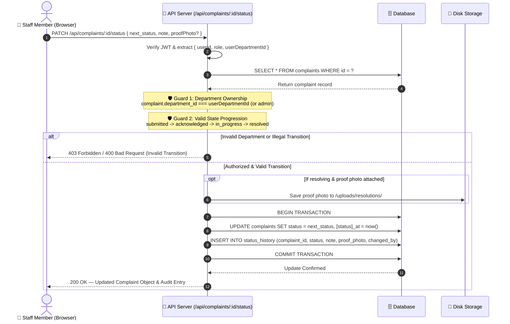
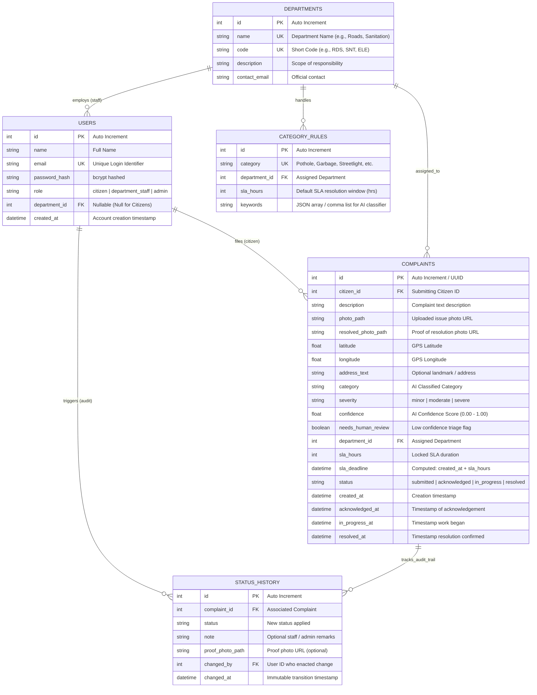
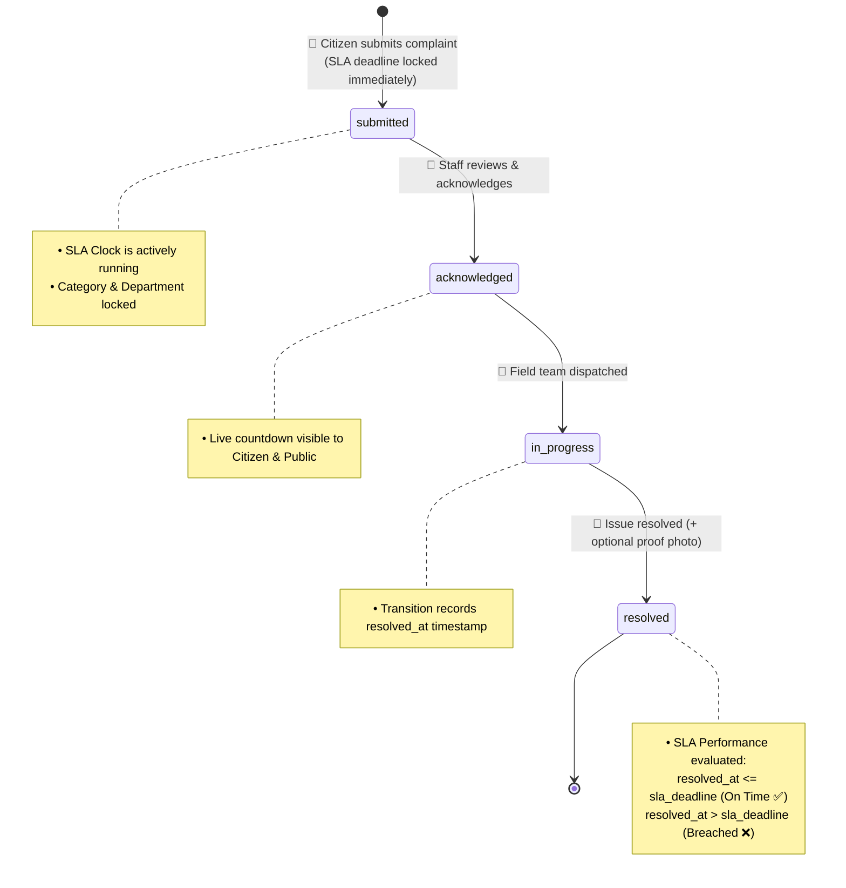

# 🏛️ Architecture & System Design Document
## Project: Civic-Sense
### AI-Powered Civic Complaint Router & Public Accountability Platform

**Version:** 1.0  
**Status:** Approved — MVP Architecture  
**Companion to:** [`PRD.md`](file:///c:/Users/yuvra/OneDrive/Desktop/CivicSense/docs/PRD.md)  
**Purpose:** Technical blueprint detailing system components, request flows, database schema, state machines, folder structure, and security boundaries.

---

## 1. 🌐 System Overview & Architecture Diagram

Civic-Sense is architected as a **modular monolith** web application serving three distinct user surfaces (Citizen, Department Staff, and Public Watchdog) from a single codebase and database. This keeps deployment, execution, and local development zero-overhead and highly reliable without unnecessary distributed complexity.



---

## 2. 🎯 Component Responsibilities & Boundaries

To preserve architectural integrity and support swapping in multimodal vision AI models later, strict component boundaries are enforced:

| Component | Core Responsibility | 🚫 Strict Constraints (Must NOT Do) |
|---|---|---|
| **🖥️ Frontend** | Render responsive UI, capture GPS/photos, trigger API requests, render SLA countdown timers | Contain business logic, calculate SLA deadlines, or bypass backend permission checks |
| **🚪 API Layer** | Authenticate JWTs, enforce RBAC, sanitize inputs, coordinate services, transaction management | Talk to DB using ad-hoc raw queries outside designated data access routines |
| **🤖 Classifier Service** | Receive photo + description $\rightarrow$ return `{ category, severity, confidence, needs_human_review }` | Know anything about department IDs, SLA hours, user accounts, or database tables |
| **⏱️ Routing & SLA Engine** | Receive `category` $\rightarrow$ lookup department, compute immutable `sla_deadline` | Know anything about image buffers, ML heuristics, or user sessions |
| **🗄️ Database** | Persist entities, enforce foreign key integrity, store append-only audit trail | Store complex business logic or mutate calculated audit timestamps |

> [!IMPORTANT]
> **Why this separation matters:** The classifier is the single component most likely to evolve (from keyword/heuristic regex to multimodal LLMs/Vision APIs). Because it adheres strictly to a standardized input/output contract, swapping the AI model requires updating **exactly one file** (`services/classifier.js`) without changing database schemas, routing rules, or frontend dashboards.

---

## 3. 🔄 Request Flow: Citizen Submits a Complaint

The complaint submission flow is synchronous, deterministic, and executes in under 3 seconds end-to-end:



---

## 4. 🔄 Request Flow: Department Staff Status Update

Status progression is strictly forward and guarded by role-based ownership checks:



---

## 5. 🗄️ Database Schema & Entity-Relationship Design

The schema enforces strict referential integrity, role scoping, and an immutable audit trail.



> [!TIP]
> **Why `status_history` is critical:** The `status_history` table serves as an append-only ledger. The public dashboard computes average resolution times and breach statistics directly from historical logs, preventing departments from altering past records or manipulating metrics.

---

## 6. 🔁 Status Lifecycle State Machine

The complaint status transitions strictly forward along an enforced progression pipeline:



- **Invariant 1:** Cannot transition backward (e.g., `in_progress` cannot revert to `submitted`).
- **Invariant 2:** Cannot skip intermediate states (e.g., cannot jump from `submitted` directly to `resolved`).
- **Invariant 3:** Transitions are verified and logged server-side with user identity stamps.

---

## 7. 📁 Project Folder & File Structure

```
civic-sense/
├── server.js                     # Main application entry point
├── db/
│   ├── schema.sql                 # DDL definitions (tables, indices, foreign keys)
│   ├── database.js                # SQLite connection pool & migration runner
│   └── seed.js                    # Demo seed data (departments, rules, test users)
├── services/
│   ├── classifier.js              # AI classification service (swappable adapter)
│   ├── routingEngine.js           # Category-to-Department & SLA calculation engine
│   └── slaService.js              # Live SLA breach evaluation & metrics calculator
├── middleware/
│   ├── auth.js                    # JWT token extraction & verification
│   ├── rbac.js                    # Role guards (citizen, department_staff, admin)
│   └── upload.js                  # Multer disk upload handler & file type validator
├── routes/
│   ├── auth.js                    # /api/auth (register, login, me)
│   ├── complaints.js              # /api/complaints (submit, list, getById, updateStatus)
│   ├── departments.js             # /api/departments (list departments & queues)
│   └── public.js                  # /api/public (city metrics, department stats, live feed)
├── public/                        # Lightweight responsive web frontend
│   ├── index.html                 # Hero landing page & navigation
│   ├── login.html                 # Login & Registration modal/page
│   ├── report.html                # Citizen reporting wizard with GPS & Camera
│   ├── my-complaints.html         # Citizen personal tracking dashboard
│   ├── department.html            # Department staff triage & action portal
│   ├── public-dashboard.html      # Public watchdog performance dashboard
│   ├── css/
│   │   ├── main.css               # Global styles, typography & color variables
│   │   └── components.css         # Cards, badges, SLA countdown tickers, steppers
│   └── js/
│       ├── api.js                 # API client wrapper
│       ├── auth.js                # Token management & session handling
│       └── utils.js               # SLA countdown timer & date formatting utilities
├── uploads/                       # Persisted user media
│   ├── complaints/                # Submission evidence photos
│   └── resolutions/               # Staff resolution proof photos
└── docs/                          # Project specifications
    ├── PRD.md                     # Product Requirements Document
    ├── ARCHITECTURE.md            # System Architecture & Technical Design (This file)
    └── TASKS.md                   # Task breakdown & execution roadmap
```

---

## 8. 🛠️ Technology Stack & Selection Rationale

| Layer | Chosen Technology | Architectural Rationale |
|---|---|---|
| **Backend Runtime** | **Node.js + Express** | High I/O performance, minimal boilerplate, rich middleware ecosystem, single-developer friendly. |
| **Database** | **SQLite (`better-sqlite3`)** | Zero-configuration file-based DB, synchronous low-latency execution, perfect for city-scale MVP; readily portable to PostgreSQL. |
| **Authentication** | **JWT (jsonwebtoken) + bcryptjs** | Stateless, horizontally scalable token verification with robust password hashing (10 salt rounds). |
| **File Storage** | **Multer (Local Disk)** | Native multipart/form-data parsing with disk persistence; cleanly abstractable to S3/Cloud Storage. |
| **Frontend UI** | **Vanilla HTML5 + Modern CSS + JS** | Zero build step friction, immediate browser reloading, lightweight, and blazing-fast rendering. |

---

## 9. 🛡️ Security Boundaries & Invariants

1. **Server-Side Authorization**: Every state-changing endpoint verifies the JWT token, extracts user roles, and verifies departmental ownership. Frontend button visibility is purely cosmetic.
2. **Department Data Isolation**: Department staff accounts are isolated to their specific `department_id`. SQL queries explicitly enforce `WHERE department_id = ?` for all staff queries.
3. **Public Anonymity Safeguard**: All public dashboard endpoints (`/api/public/*`) strip out `citizen_id`, citizen names, email addresses, and phone numbers.
4. **Tamper-Proof SLA Math**: The SLA deadline is locked at `created_at + sla_hours` and cannot be modified by staff. Breach flags are computed live based on time elapsed.

---

## 10. 📈 Scalability & Evolution Roadmap

When Civic-Sense expands beyond the initial MVP:

```
[Phase 1: MVP]               [Phase 2: Vision & Maps]          [Phase 3: Production Scale]
• SQLite Database       -->  • Geospatial GIS Mapping     -->  • PostgreSQL + PostGIS
• Keyword Classifier    -->  • Multimodal Gemini Vision   -->  • Redis / BullMQ Job Queue
• Disk File Storage     -->  • Real-time WebSocket alerts -->  • S3 / Cloud Bucket Storage
```
